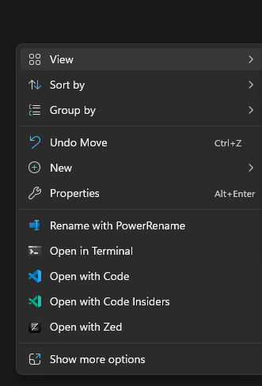

# Introduction to Python

## Setup

This is a lesson on how to write a computer program. We are going to be doing this using the language Python, which according to [one of the industry's biggest surveys](https://survey.stackoverflow.co/2024/technology#admired-and-desired-language-desire-admire) is the most desired programming language in the world, meaning more developers who don't already use it want to start using it than for any other language. It's very approachable. It was named after the British comedy group Monty Python who made movies like the one about the Holy Grail. We're going to use it to write a computer program. Does everyone have Python?

We're going to install it using a tool called uv, which these days is the most modern and one of the most widely used ways to interact with Python; it handles both installing Python itself and managing Python projects, so you don't need to separately download Python from python.org. It's really easy to use, and it's made by Astral, a group that's built a bunch of other fast, useful Python tooling and has since been acquired by OpenAI. To install uv, follow the instructions at <https://docs.astral.sh/uv/getting-started/installation/> for your operating system (a single command you paste into PowerShell on Windows, or Terminal on Mac and Linux). Once that's done, uv will take care of getting you a working copy of Python behind the scenes.

I don't want to dwell on getting everyone to set up fancy coding and editing software, so I'm going ask everyone to create a super basic setup for this. Make a new folder on your computer, called something like "fun_programs". Open up a plain text editor such as Rift or Vim or Notepad or TextEdit and save a new file in that folder called `quiz.py`. Then, open a terminal window in that folder.

Windows used to make you choose between two terminal apps, an old one called CMD and a newer one called PowerShell. These days it has something better: Windows Terminal, a tabbed app that can run PowerShell (or CMD, or a Linux shell , or almost anything else compatable) inside it. It's one of the nicer pieces of software Microsoft has put out lately. To open it, just right click in the blank space in a folder and click the "Open in Terminal" option in the menu that appears:



Mac OS X has one terminal application. It is called "Terminal." You are going to need to open it and then switch what folder is open in it. To do that, open the Terminal, type the letters "cd" and then a space, and then drag the folder you're working with from the Finder into the terminal window. Then hit enter. (cd stands for "change directory.")

If you're on Linux, I'm assuming you know what you're doing. Good luck, or ask someone else here and see what happens.

Programmers like to run programs by typing the programs' names into command lines instead of double-clicking on icons for them because it's easier to specify options and automate things that way. This is how we're going to run our Python programs, but also, pretty much any program that you write can be executed using the command line; you can compile and run the C++ programs that you write in university CS classes using the same basic method. We're going to write a program here in the text editor that you opened. It will look like this:

```python
print("Hello, World!")
```

Write that, and then save it. Then, leave the text editor open, but run your new program in the command line by typing `uv run quiz.py`. The first time you do this, uv will notice you don't have a Python interpreter set up yet and will quietly download one for you before running the program, so it might take a few extra seconds.

Did that work? If it did: great! The boring part is over. Now we can start programming. The hardest part of running Python programs is often the setup, even in this case where it's a really simple one.

[Python docs: Using the Python Interpreter](https://docs.python.org/3/tutorial/interpreter.html)

## Variables and strings

You may have noticed that we have now written a computer program. It outputs the words "Hello, World" into the command line in which it was run. The word "print" in computer programming actually means "output this text to the command line;" it used to involve printers, but since then, screens have been invented. The punctuation requirements here are pretty specific: you have to have the word "print", an open parenthesis, a quotation mark, some text, a closing quotation mark, and a closing parenthesis. All of this punctuation is part of an understandable system: I promise. And now we can start to pull it apart and understand how it works.

We've technically written a computer program, but it's not a very impressive one. Let's build something you can play: a trivia quiz that asks you questions, keeps score, and can be restocked with new questions without touching the code. A suprising amount of computer programs, basically exist just to store questions and ask them back to you.

To start storing trivia questions in my program, I'm going to create my first variable. You're probably vaguely familiar with the concept of variables from algebra. In programming, we don't really solve for them, we use them in a very straightforward way: we pick a variable name, like "question", and we store some data under it.

```python
question = "Who originally developed Python?"
```

If you put some text in quotation marks, you create a string, which is text-based data that you can have in a program. The quotation marks mean, "this text is here purely to be used as data; it does not contain commands or instructions or stuff the program needs to do." Equals signs assign data to variable names. You probably get the idea. Now, I want to change the print statement. Instead of printing out Hello, World, I want to print my trivia question. I can do that without retyping the question by using the variable like this:

```python
print(question)
```

Run this program on the command line by typing `uv run quiz.py`. As you can see, whereas before we were printing a string, we are now printing a variable, and we are getting the string that was stored in that variable. In general, variable names give you a way to refer to data without writing all the data out; you can think of them as being automatically replaced by that data behind the scenes. Change it to something random and try again:

```python
question = "What do the knights in Monty Python and the Holy Grail use instead of horses?"
print(question)
```

This works too.

[Python docs: Strings](https://docs.python.org/3/tutorial/introduction.html#strings)

## Lists and for loops

Now, if I'm going to store a whole quiz's worth of questions in a program, I want it to be able to grow to an arbitrary size. One obvious approach to store multiple questions would be to make variables called question1, then question2, then question3, but fundamentally that would be really tedious and limit you in the number of questions you could store. Instead, we're going to make a list, which will let us store an arbitrary number of separate strings in a single variable. The list is a fundamental data structure in Python and you will not get far without it.

```python
questions = [
    "Who originally developed Python?",
    "What do the knights in Monty Python and the Holy Grail use instead of horses?",
    "What number do programmers start counting from?",
]
```

You might reasonably ask: those square brackets look important, but how is this really different from making one long string with all the questions in it? It turns out that lists bring up a lot of possibilities. For example, you can select items from them by their position in the list, which is called their index:

```python
print(questions[1])
```

This prints the middle item in this list because items in lists in programming are numbered starting from 0, so the items we have here are numbered 0, 1, and 2. We've also unlocked an important programming ability, which is the chance to do something over and over again with a structure called a loop:

```python
for question in questions:
    print("Here's a question:")
    print(question)
```

This kind of loop is called a "for loop", and the idea is that it does something once for each item in a list. The first line kind of announces the loop; you use the keywords "for" and "in" and alongside them, you put the variable that's storing your list, and also, before that, a new variable name that will be used for each item in the list. For each of the values in that list, the lines of code that are indented will be run, with each successive list item available under the new variable name, "question", within them. (You can indent lines by pressing tab on your keyboard in front of them.)

[Python docs: Lists](https://docs.python.org/3/tutorial/introduction.html#lists), [Python docs: for Statements](https://docs.python.org/3/tutorial/controlflow.html#for-statements)

## Built-in functions and numbers

We've explored quotation marks, commas, square brackets, and the magic words "for" and "in". Now we finally have to talk about the parentheses. Parentheses are used to invoke functions, which are basic reusable pieces of code. Python provides for us a function called "print" that does the boring but important work of sending text to the command line. By putting parentheses after this function name, you are calling or invoking the function, and you can give it some bonus information about what you want it to do by putting some kind of input inside the parentheses. In this case, when we call "print", we want to tell it what to print in that way.

There are other built-in functions. For example:

```python
number_of_questions = len(questions)
print(number_of_questions)
```

"len" is the abbreviated form of the word "length" and, when called as a function with our list of questions as its input, it will tell us how long our list is. When functions give us information, it's called "returning" something, and you can imagine that the code `len(questions)` disappears and is replaced by the data the function ends up returning; in this case, the number 3.

*The below math content and extra built-in functions could be cut for time*

By the way, did you know that you can store numbers in variables? Those are different from strings. You can do math with them.

```python
number_of_questions = len(questions)
print(number_of_questions + 2)
```

I don't know why you would want to do that specifically! But the point is, when a variable stores a number you can use it for math. (When it stores a string, not so much.) Pretty much any mathematical expression that you can type into a calculator, you can type into a programming language, and in the programming language you can use variable names when you want to use values that a program has previously stored. Just like how a function call disappears and is replaced with its result, mathematical expressions just sort of disappear when the program runs and are replaced by their answer.

There are more built-in functions in Python. Watch this:

```python
number_of_questions = len(questions)
questions_squared = pow(number_of_questions, 2)
print(questions_squared)
```

Look at that! I don't know why you would want to do this either, but you can raise a number to the power of 2 (or anything else) with the `pow` function, store the result in a variable, and print that out. Notice that this function, the `pow` function, takes two different values as inputs, separated by commas. They both have to be numbers, and it will return the first raised to the power of the second. Now watch this.

```python
print(min(number_of_questions, questions_squared))
print(max(number_of_questions, questions_squared))
```

`min` is a function that takes two inputs and returns whichever is smaller. `max` is a function that does the same thing but returns whichever is larger. Also, look: I am putting function calls inside of function calls. When you do this, the results are evaluated from the inside out. On the inside, the call to max is basically replaced with its result, and then the call the print happens with that as its input. You can imagine the whole thing, `max(number_of_questions, questions_squared)` being replaced by the number 9, because that's the larger number: `print(max(number_of_questions, questions_squared))` becomes just `print(9)`.

[Python docs: Built-in Functions](https://docs.python.org/3/library/functions.html)

## User input

The problem is, it's too easy to figure out what the results of these function calls will be, because the values stored in the variables are completely predictable. To write a real computer program, we want them to change over time. To do this, let's create a new variable and learn one more function call that will completely change what our program is capable of.

```python
new_question = input("Enter a trivia question:")
print("You entered:")
print(new_question)
```

This new function, "input", initially seems to act like the print function, but there's something else that happens after your string is printed out: it collects some text from the command line and returns it so that text can be stored in a variable. To see this, you have to type the text into the prompt at the command line and then hit enter. So when I run the program and type What is the airspeed velocity of an unladen swallow?, that string goes inside the program and can be referred to with a variable. We can take this one step further:

```python
new_question = input("Enter a trivia question: ")
questions.append(new_question)
print(questions)
```

There are two basic types of functions in Python: those that are free-floating and those that are part of a particular data structure. The functions we've been using up to this point are free-floating functions that operate on single values; however, a list is an example of a data structure and lists have lots of member functions that are list functions that are specific to lists. For example: the member function "append". To access a member function, take a data structure, put a dot after it, put the name of the function, and then call it with parentheses and usually an input.

I say usually an input. Strings are data structures too, and they have lots of fun member functions that don't happen to need any input.

```python
print(new_question.lower())
print(new_question.upper())
```

Structures that package functions and data together like strings and lists do are usually called objects.

[Python docs: input()](https://docs.python.org/3/library/functions.html#input), [Python docs: String Methods](https://docs.python.org/3/library/stdtypes.html#string-methods)

## Conditions: while loops and if statements

*This whole section could be cut for time; if statements would then be introduced under "Custom functions"*

Objects are a whole extra can of worms, so let's go back to making our variables less predictable. Replace the line `questions.append(new_question)` in that earlier code with this:

```python
new_question = input("Enter a trivia question: ")
while new_question != "quit":
    questions.append(new_question)
    new_question = input("Enter a trivia question: ")
```

This is a while loop. Like a for loop, it will run some indented code over and over. Unlike a for loop, it can run indefinitely, instead of just activating once for each item in a list. In the first line of our while loop, which has to use the keyword "while", we have the symbols exclamation mark and equals. Together, these two symbols mean "does not equal." With that in mind, you can read this kind of like English: while the variable new_question does not equal the string "quit", run these indented lines of code. This loop would run forever if we had no opportunity to modify the value stored by `new_question`, but luckily we do: over and over again, the result of the call to the "input" function will be assigned to it.

In other words, this code will first ask us to enter a trivia question. Then, it will start executing the code that's indented under the while loop (unless we typed "quit" to begin with; while loops do not always get the chance to even run once.) In so doing, it will append that new question to the list "questions" and then ask us for another trivia question. These last two steps will repeat (in a \*loop*) until new_question is equal to the string "quit" because we typed "quit" into the command prompt. This allows us to enter and store an indefinite number of questions and then stop when we want to.

If your while loop ever tries to run away with your program and starts running over and over again, click in the console and press Control-C to stop it, and then take a look at the code again.

The ability to do things over and over again an arbitrary number of times is very important and useful, and our code is getting more like a real program by the second. However, there is one problem. If I were to do something dumb like just hit enter a bunch of times when it asked me to input a trivia question, the result would be a bunch of empty strings in the `questions` list. That's right: it turns out that strings can be empty and store zero characters. To prevent that, we can set up a guardrail with an if statement:

```python
while new_question != "quit":
    if len(new_question) > 0:
        questions.append(new_question)
    else:
        print("question too short >:(")
    new_question = input("Enter a trivia question: ")
```

This code uses the magic words "if" and "else" and the function "len" that we looked at before. That's right: it turns out that strings have lengths just like lists do, and you can use the same function to get them. An if-else statement will run some indented code if some certain logical condition is true: in this case, if the length of the new question is greater than 0. Otherwise, it will run some different code, which needs to appear below a line that just says "else:"; in this case, we're printing an error message to the program's user. Which is you in this case, but could be someone else in other contexts.

Note that this is different from the condition in the while loop because we're not stopping the whole process based on it; we're printing an error message if what we want to be true isn't true, but the loop will still continue, so the user can try again. Aside from that, though, the types of conditions that can be used in while loops, in if statements, and in other places are all the same, and we could use a while loop with a greater-than symbol or an if statement with a not-equal-to symbol if we wanted.

So, we now have the ability to feed our computer an infinite supply of trivia questions.

[Python docs: More Control Flow Tools](https://docs.python.org/3/tutorial/controlflow.html)

## Custom functions

We are halfway to having a program that can store a bank of trivia and quiz you on it. To do this, I'm actually going to switch to a fresh version of the code that isn't going to ask me to enter data every time I run it: for demonstration purposes, I'm going to work with a static list of known answers. This is basically just cheating to avoid entering them all into the command line.

```python
answers = ["Guido van Rossum", "Monty Python", "Coconuts"]
```

Now, we want to implement an answer-checking "lightning round": type in any guess, and if it matches one of our stored answers, the game tells you so. To do this, we are going to define a custom function called `check_answer`. To define a function, you write the keyword "def", the name you're giving to the function, and then parentheses with a list of the input variables you want the function to have (in this case only one). The input variables consist of things you want to potentially change every time the function is run; otherwise, you can use the so-called global variables from outside the function normally, although doing that too much can get a little bit disorganized.

```python
def check_answer(guess):
```

This input variable `guess`, which is called a parameter, doesn't have any intrinsic value. However, when the function is called, it will be given the value that is placed within the parentheses at that point in the code; it's basically a placeholder for now. Now we need an indented block of code that will actually run at the point at which the function is called.

```python
def check_answer(guess):
    for answer in answers:
        if guess == answer:
            print("Correct! The answer was:")
            print(answer)
```

We are approaching dangerous levels of indentation here, so let's break this down. All of the code that is part of the function and thus will run when it is called needs to be indented to indicate that it's part of the function. Then, we start a for loop; remember, this will set the new variable `answer` equal to each successive item in our list `answers`. The code that is repeatedly run by the for loop has to be indented too, to indicate that it's inside the loop. Then we have an if statement, which specifies that the indented code below it will only run if a certain condition is true. In this case, the condition compares the parameter `guess` to the loop variable `answer` using the double equals sign operator, which looks for equality between the thing on the left and the thing on the right of it. (The single equals sign needs to be used only for assignment, not for comparison.) And the indented code under the if statement, which will be run if the condition is true, simply prints the loop variable `answer` out.

Whew. We can now call this function with some inputs:

```python
check_answer("Coconuts")
```

The parameter `guess` will take on the value of the string "Coconuts", and that answer will be found in the list and then printed out as the function runs with those variables. That's all very well, but it's very predictable since the guess string is baked right into the program. Let's try getting it from user input:

```python
guess_from_input = input("Guess an answer: ")
check_answer(guess_from_input)
```

Now we're using something from user input as a guess, and it can be different every time. So that's cool. But the program is still kind of boring since we're getting out exactly what we're putting in. Let's make one small change to our `check_answer` function:

```python
def check_answer(guess):
    for answer in answers:
        if guess in answer:  # <-- in!
            print("Correct! The answer was:")
            print(answer)
```

Now, instead of the `print` code running if the guess and a stored answer are exactly equal, it will run if the guess is merely somewhere inside the answer. This means I can now just type "Python" and the game will happily tell me I got "Monty Python" right, without me ever typing the whole thing.

So now, after much tumult and turmoil, we have a bad trivia game.

[Python docs: Defining Functions](https://docs.python.org/3/tutorial/controlflow.html#defining-functions)

## Named tuples for details

Temporarily comment out the lines with the word "input" in them for this section. In other words, put the character "#" in front of them, which will prevent them from being executed.

This is all very well as a way to check single answers, but it would be nice if we had a way to store more data than just the answer to a question. Right now, each question is a single string; what would be better would be to have a collection of values for each question, so we can know more things about it: what it's asking, what the correct answer is, and what category it belongs to. To do this, we can create objects.

An object is a value that can contain all of the data that you have about a specific noun: a person, place, or thing (or in this case, a question). We've been representing trivia questions with plain strings, but objects let us represent them more fully. To represent a single trivia question, I would want to store the variables "prompt", "answer", and "category"; all three are strings this time. With an object, we can store all of these things for each question.

Before you create an object in Python, you must create a class, which is basically a template for an object. In this lesson, we're going to create a very simple class in a very quick and simple way. At the very top of your Python file, put this:

```python
from collections import namedtuple
```

Python contains a lot of built-in functions that aren't available by default but can be made available with an import statement like this one. This import statement makes the function `namedtuple` available. We can use it to create a class like this:

```python
QuestionClass = namedtuple("QuestionClass", ["prompt", "answer", "category"])
```

The `namedtuple` function takes two inputs. The first is the name of the class (the template for objects) that you're creating; the second is a list of names of the variables that you want the objects to store. The thing that we're storing in the variable `QuestionClass` over there on the left is a new function that will let us actually create objects, now that we have the class (the template.)

```python
question_object = QuestionClass("Who originally developed Python?", "Guido van Rossum", "Python")
```

If you print your question object, you'll see all its internal variables clearly displayed:

```python
print(question_object)
```

And if you ever want to access one specifically, you can put a dot and then the variable name.

```python
print(question_object.answer)
```

We could create a whole list of these objects directly in our code, the same way we made a list of strings earlier. But it's nicer to keep the actual quiz content separate from the program logic, so anyone can add new questions without having to write Python. Let's load our questions from a plain text file instead.

Each line of the file holds one question, with the prompt, the answer, and the category separated by commas, basically a list, just written as plain text instead of Python syntax:

```
Who originally developed Python?,Guido van Rossum,Python
What do the knights in Monty Python and the Holy Grail use instead of horses?,Coconuts,Movies
What number do programmers start counting from?,0,Python
```

To get that back into a real list of `QuestionClass` objects, we open the file and read through it:

```python
quiz = []
with open("questions.txt") as file:
    for line in file:
        prompt, answer, category = line.strip().split(",")
        quiz.append(QuestionClass(prompt, answer, category))
```

`with open("questions.txt") as file:` is called a context manager. It hands you the open file as `file` for everything indented underneath, and then automatically closes it once the block ends, even if something goes wrong partway through, so you don't have to remember to call `file.close()` yourself. Looping `for line in file:` gives you one line at a time, and `.strip()` clears the trailing newline before we `.split(",")` it back into three separate pieces.

Now we can finally put it all together and actually play the quiz. We'll write one more function, `ask_question`, that takes a `QuestionClass` object, prints its prompt with `input`, checks the answer you typed against the one stored on the object, and returns `1` if you got it right or `0` if you didn't:

```python
def ask_question(question):
    guess = input(question.prompt + " ")
    if guess.lower() == question.answer.lower():
        print("Correct!")
        return 1
    else:
        print("Nope, the answer was:")
        print(question.answer)
        return 0

score = 0
for question in quiz:
    score = score + ask_question(question)

print("You got " + str(score) + " out of " + str(len(quiz)) + " right!")
```

That last part, `return`, is new: it's how a function hands a value back to whatever called it, instead of (or as well as) printing something. We use that here to add either a `1` or a `0` onto a running `score` for every question in the `quiz`, and print out the final tally at the end. A proper trivia game with an actual score, instead of the free-for-all lightning round from before.

As a bonus, since each question now carries its own `category`, we can also write some completely optional bonus functionality: a way to browse the quiz bank by topic, using the exact same `in`-based trick from the lightning round earlier, just aimed at `question.category` instead of a plain list of strings.

```python
def questions_in_category(category_term):
    for question in quiz:
        if category_term in question.category:
            print("Found:")
            print(question)

questions_in_category("Python")
```

And now, if you uncomment (remove the "#" in front of) those input lines from before, you've got a real, playable trivia game: one that asks real questions, checks real answers, keeps score, and can be restocked with new questions just by editing a text file.

[Python docs: namedtuple](https://docs.python.org/3/library/collections.html#collections.namedtuple), [Python docs: Reading and Writing Files](https://docs.python.org/3/tutorial/inputoutput.html#reading-and-writing-files), [Python docs: the with statement](https://docs.python.org/3/reference/compound_stmts.html#the-with-statement)

## Conclusion

We now have a Python program that quizzes you, keeps score, and loads its questions from a file. I imagine this will be helpful for all of your lucrative trivia-night careers. Along the way, we have learned about strings, variables, lists, loops, input, functions, objects, and reading from files. This was basically a semester-long introductory class in one session. In the future, you may want to learn about more of the classes and functions built into Python; you will probably want to create classes in which you can define custom functions that are attached to specific objects; and you may even want to know how to store your quiz data somewhere fancier than a text file, like an actual database. But this should give you a basic foundation for doing stuff with Python. Have fun.

[Python docs: The Python Tutorial](https://docs.python.org/3/tutorial/index.html), [Python docs: Classes](https://docs.python.org/3/tutorial/classes.html)
